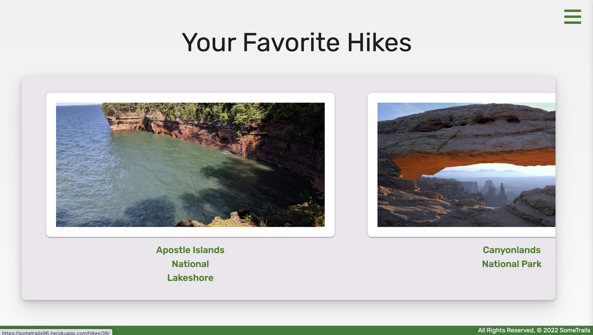
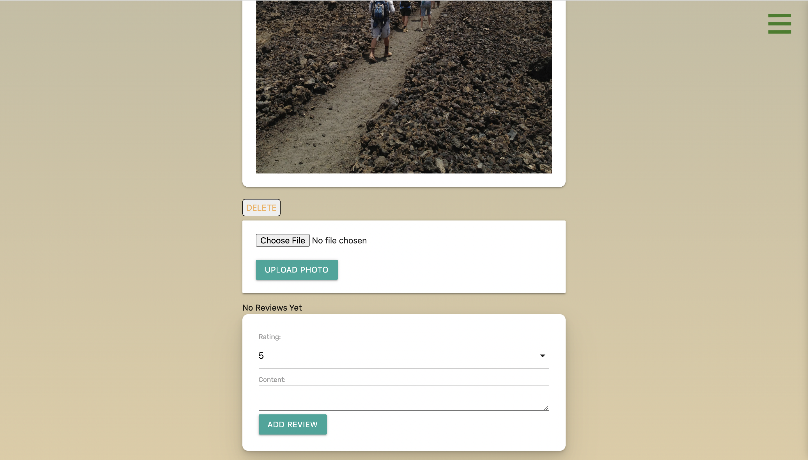
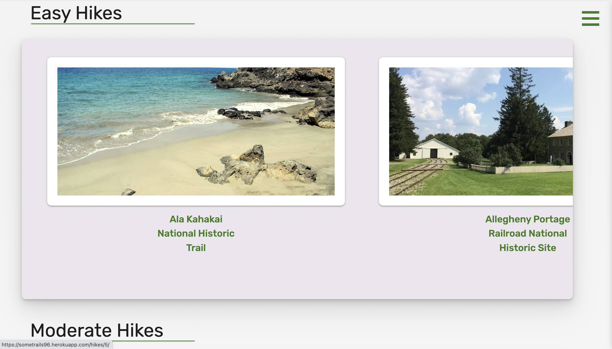

# SomeTrails

## About

SomeTrails is a hike planning utility inspired by AllTrails. This project was a team effort from Chase Allman-Knieper, Aaron Lee, and Maggie Yu. 

## Getting Started:
The site can be found at <a href="https://sometrails96.herokuapp.com/">here</a>

The source code can be found <a href="https://github.com/achasek/sometrails">here</a>

## Requirements

- asgiref==3.5.2
- boto3==1.25.1
- botocore==1.28.1
- certifi==2022.9.24
- charset-normalizer==2.1.1
- dj-database-url==1.0.0
- Django==4.1.2
- django-environ==0.9.0
- django-on-heroku==1.1.2
- django-postman==4.3.1
- gunicorn==20.1.0
- idna==3.4
- jmespath==1.0.1
- psycopg2-binary==2.9.4
- python-dateutil==2.8.2
- requests==2.28.1
- s3transfer==0.6.0
- six==1.16.0
- sqlparse==0.4.3
- urllib3==1.26.12
- whitenoise==6.2.0

##Screenshots:

## Technologies Used:
- HTML
- CSS
- Materialize
- Python
- JavaScript
- Django
- RESTful API's
- PostGresQL

## Coming Soon
- Weather Data from API
- Bathrooms nearby
- Map Data